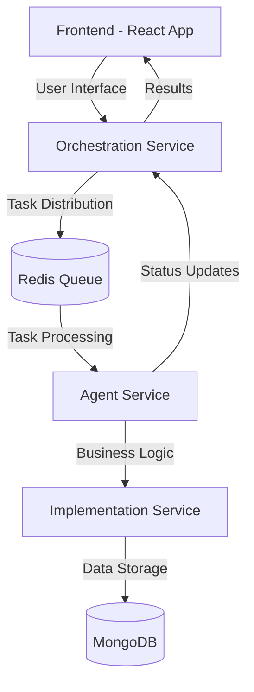
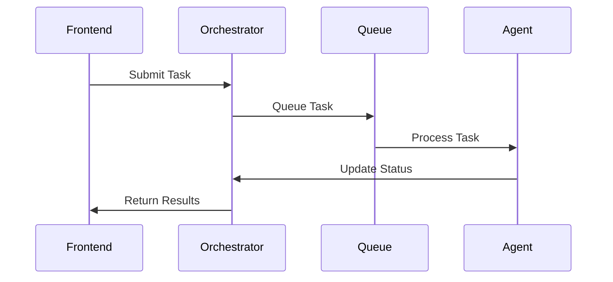
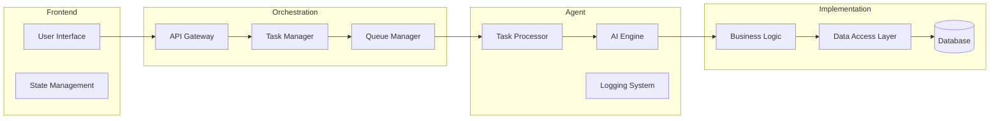

# Skynet
>  Bringing agents on-chain with semi-autonomous decision making. Powered by Okto SDK, Aptos and Polygon.

Skynet is a revolutionary cross-chain trading bot that uses Okto SDK's custom JWT auth to enable autonomous on-chain actions. The agentic layer implements a reAct agent pattern that can programmatically create cross-chain wallets and execute gasless transactions across Polygon and Aptos networks. Users connect their Okto wallets through the frontend to pool funds into the bot's trading strategy. The bot analyzes Telegram group sentiment by submitting trading proposals, reading chat responses, and autonomously deciding whether to execute buy/sell orders based on community feedback.

## Architecture Overview



## Component Breakdown

### 1. Frontend Service
- **Tech Stack**: React, TypeScript, TailwindCSS
- **Purpose**: Provides the user interface for interacting with the Skynet system
- **Key Features**:
  - Modern UI/UX design
  - Real-time task status updates
  - Interactive agent communication interface

### 2. Orchestration Service
- **Tech Stack**: TypeScript, Node.js
- **Purpose**: Central coordinator for the entire system
- **Key Features**:
  - Task queue management
  - Agent coordination
  - System state management
  - API gateway for frontend communication



### 3. Agent Service
- **Tech Stack**: TypeScript, Node.js, LangGraph
- **Purpose**: Intelligent agent that processes tasks and makes decisions
- **Key Features**:
  - Natural language processing
  - Task execution
  - Decision making
  - Integration with implementation service

### 4. Implementation Service
- **Tech Stack**: TypeScript, Node.js
- **Purpose**: Business logic and data management
- **Key Features**:
  - Core business logic implementation
  - Database operations
  - Data processing and validation

## Data Flow



## Package Dependencies

### Frontend
- React
- TypeScript
- TailwindCSS
- React Query
- Axios

### Orchestration
- Express
- TypeScript
- Redis
- MongoDB
- Socket.io

### Agent
- TypeScript
- LangGraph
- OpenAI SDK
- Express
- Jest (Testing)

### Implementation
- TypeScript
- Express
- MongoDB
- Node.js
- Nodemon (Development)

## System Requirements

- Node.js >= 18
- Redis
- MongoDB
- Docker (optional)
- Yarn/NPM

## Environment Setup

Each service contains its own `.env.example` file with required environment variables. Copy these to `.env` files and configure accordingly.

## Development Workflow

1. Clone the repository with submodules:
```bash
git clone --recursive git@github.com:your-username/skynet-monorepo.git
```

2. Install dependencies in each service:
```bash
cd frontend && yarn install
cd ../orchestration && yarn install
cd ../agent && yarn install
cd ../implementation && yarn install
```

3. Configure environment variables

4. Start services:
```bash
# In separate terminals
cd frontend && yarn dev
cd orchestration && yarn dev
cd agent && yarn dev
cd implementation && yarn dev
```
